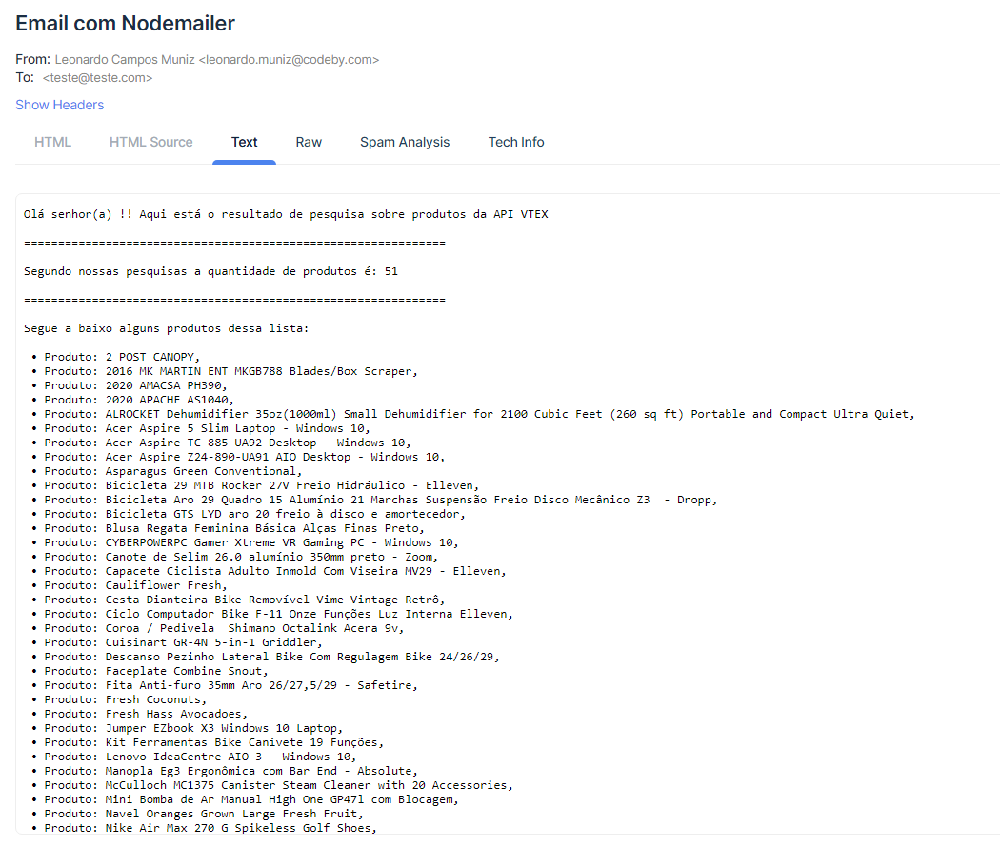

[](https://www.npmjs.com/)

<br />

<h1 align="center">
    <strong>Avaliação para a vaga de Desenvolvedor backend Codeby.</strong>
</h1>

<br/>

## **Tabela de conteúdos**
======================

   * [Sobre](#sobre-)
   * [Instalação](#instalação-)
   * [Como usar](#como-usar-)
   * [Requisitos](#requisitos-)


<br/>

## **Sobre** 📄
Este repositório tem como função a avaliação das minhas competencias (Leonardo Campos Muniz), para a vaga de desenvolvedor back end, o código deste repositório faz o envio de um e-mail para uma plataforma de envio de e-mails (Mailtrap) informando a quantidade de produtos disponíveis e também mostra uma lista de quais são esses produtos, fazendo a busca dessas informações por meio de uma API previamente disponibilizada.


<br/>

## **Instalação** 🔨
Fazendo uma cópia deste repositório utilize o comando a baixo para baixar todas as bibliotecas necessárias
<br/>

```
 yarn init -y
```

ou

```
 npm init -y
```

O seu gerenciador de pacotes irá baixar esta lista de bibliotecas:

- axios: ^0.22.0 **(Utilizada para fazer requisições na API)**,
- bull: ^3.29.2 **(o Bull faz todo o gerencimaneto de processo de filas)**,
- dotenv: ^10.0.0 **(Utilizada para a segurança das informações durante o desenvolvimento, o arquivo do próprio .env não foi anexado neste repositório pelos mesmos motívos )**,
- express: ^4.17.1,
- nodemailer: ^6.6.5 **(Esta biblioteca irá realizar o gerenciamento de E-mails)**,
- nodemon: ^2.0.13

Após realizar toda a instalação certifiquesse de duas coisas: **1°** de alterar as informações na pasta **"config"** para ser compatíveis com as da sua maquina, **2°** ter o redis instalado localmente e está pronto!

<br/>


## **Como usar** 👨‍🏭
Após fazer a instalação de todos os pacotes necessários e fazer as devidas configurações você pode digitar no seu browser o link 

```
http://localhost:3333/sendmail
```

E vera o seguinte e-mail na sua plataforma de envio de e-mails



<br/>

Abrindo o código no seu editor texto favorito você irá ver a seguinte disposição de arquivos:


<br/>


Explicando o que cada pasta ou arquivo faz:

- **Pasta [images]:** É aonde está a imagem ilustrativa do e-mail.

  - **mysite/__pycache__/:** aqui estaram todas as alterações no banco.

  - **mysite/settings.py:** aqui estão armazenadas todas as configurações importantes como chave de segurança, aplicações, banco de dados e entre outras coisas.

  - **mysite/urls.py:** se encontra aqui as rotas do projeto, tanto as principais quanto as de aplicações.

<br/>

- **Pasta [src]:** Aqui é aonde está toda a aplicação do projeto

  - **src/config/:** Aqui vão estar todas as credenciais que irá precisar como a do redis e a do email.

  - **src/jobs/:** Nesta pasta está localizado todas as funções da aplicação como o envio de e-mail

  - **src/services/:** Nesta pasta está toda a informação esterna que receberemos como a requisição de api.

  - **src/routes.js:** Parte responsável pelo roteamento do projeto.

  - **src/server.js:** Aqui se localiza o *"coração"* da aplicação, o servidor responsável por manter todo o código rodando.


## **Requisitos** 📚

- Necessário utilizar uma biblioteca de processamento em fila
- Necessário enviar email
- Necessário utilizar a API de Search da VTEX
- Necessário mostrar a quantidade de produtos disponíveis na loja pelo email


